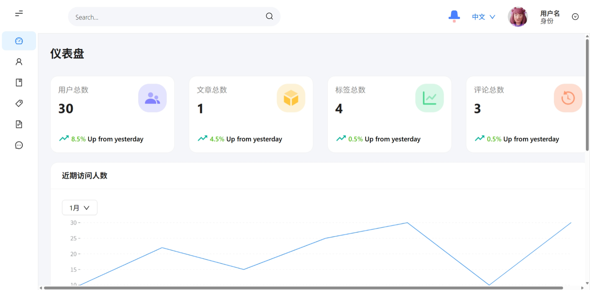

# MoonAdmin ✨

基于 React + Antd + ECharts 开发的后台管理系统，我将在这里练习跟 React，Antd，ECharts 等相关学习



# 🚀 核心亮点

# ⚡ 快速上手

## 1、克隆项目

```
git clone https://github.com/zhuming2787/MoonAdmin.git
cd admin
```

## 2、安装依赖

推荐使用 pnpm（速度更快）

```
# 安装依赖
pnpm install
```

## 3、运行项目

```
npm run dev
```

## 4、打包部署

```
npm run build
```

打包产物在 dist/目录，可部署

# 🤝 如何贡献？

## 贡献步骤

1、提 Issue：在 Issues 中提出需求 / 问题，确认开发方向

2、Fork 仓库：点击右上角 Fork 到自己的账号

3、创建分支：基于 main 分支创建，命名规则：feat/功能名/fix/BUG 名/docs/文档名

4、提交 PR：完成开发后，向本仓库 main 分支提交 Pull Request，附修改说明

## 规范要求

1、Commit 格式：type(scope): description，例：feat(comment): 新增评论点赞动效

2、代码风格：遵循 ESLint+Prettier 配置，提交前会自动检测 ESLint 规范

3、文档同步：修改功能 / 配置后，同步更新 README.md 或相关说明

# 📄 开源协议

本项目基于 MIT 协议 开源，可自由使用、修改、分发，只需保留版权声明。详情见 LICENSE。

# 📞 联系我

- 邮箱 : 2787342250@qq.com

> 感谢每一位贡献者的付出，让我们一起把这个项目做得更好！💪
